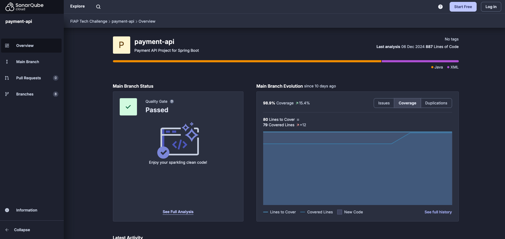

# FIAP Tech Challenge | Pós Tech

## Propósito desse projeto
Sistema para gestão de pagamentos.

## Stack utilizada
* PostgreSQL
* Java
* Docker
* Kubernetes
* Helm
* K6

## Pré-requisitos
* Ter o Docker instalado para criação e execução das imagens

## Documentação da API REST
Com a aplicação em execução, a documentação da API REST pode ser acessada através da URL: http://localhost:8080/swagger-ui/index.html

## Execução local pelo Minikube
1. Instale o Minikube em sua máquina, seguindo as instruções do site oficial: https://minikube.sigs.k8s.io/docs/start
2. Inicie o Minikube:
```bash
minikube start
```
3. Habilite o metric-server no Minikube, para que o autoscale possa funcionar corretamente:
```bash
minikube addons enable metrics-server
```
4. Instale o Helm, seguindo as instruções do site oficial: https://helm.sh/docs/intro/install/
5. Utilizando o Helm, instale o PostgreSQL no Kubernetes:
```bash
helm install database oci://registry-1.docker.io/bitnamicharts/postgresql --set auth.database=taste_food --set auth.username=taste_food --set auth.password=nSKcUf5Ms9CYQT8jz7kpNA
```
6. Dentro do diretório do projeto, execute o comando passando o diretório `k8s` como parâmetro, assim todos os arquivos dentro dele serão aplicados no Kubernetes:
```bash
kubectl apply -f k8s
```
7. Descubra o IP do Minikube, que precisamos para acessar a aplicação:
```bash
minikube ip
```
8. Se tudo ocorrer normalmente, a aplicação já poderá ser acessada através do IP exibido, na porta 30000.
9. Instale o K6, seguindo as instruções do site oficial: https://grafana.com/docs/k6/latest/set-up/install-k6/
10. Execute o teste de carga na aplicação e será possível observar o autoscale em ação:
```bash
# - O IP utilizado no comando deve ser o IP do Minikube, obtido através dos comandos anteriores.
# - Os parâmetros 'vus' e 'duration' podem ser ajustados de acordo com a carga desejada no teste.
k6 run -e HOSTNAME=192.168.49.2:30000 --vus 100 --duration 30s script.js
```

## Cobertura de código do sistema

Pode ser analisado melhor a cobertura no seguinte link: https://sonarcloud.io/project/overview?id=fiap-tech-challenge-7soat-g13_payment-api



Existem outros endpoints no sistema, como alteração e exclusão de produto, listagem de clientes, etc. Para visualização completa sugerimos a acessar o Swagger ou a utilização da collection do Postman.
## Autores
* Cristiano de Barros
* Graziela Göedert de Souza
